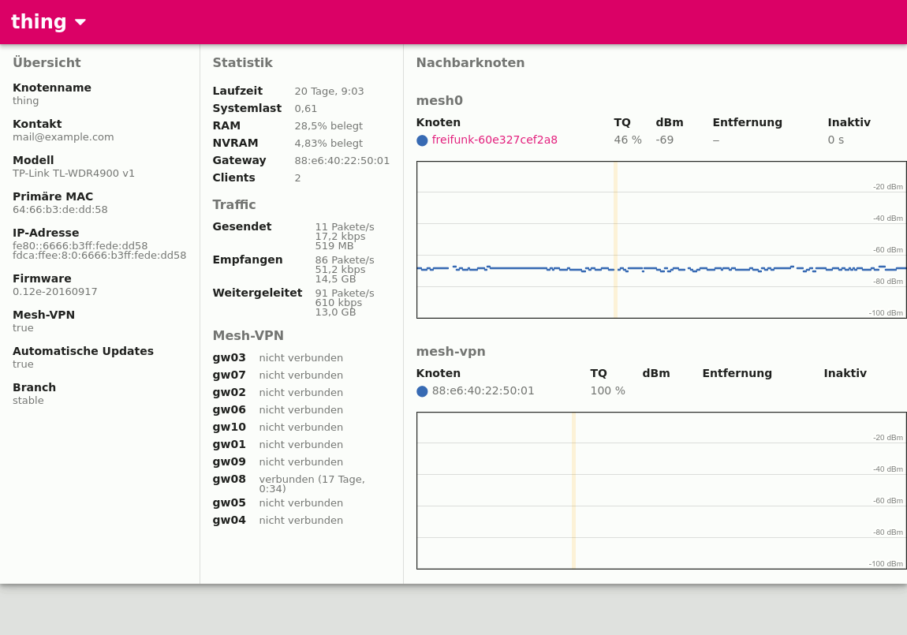

Status-Page
===========

By using the package ``gluon-status-page`` it is possible to provide a http
based information page on each router:

Internals
---------

The package ``gluon-status-page-api`` provides the following http resources/urls::

  /cgi-bin/
  ├── interfaces                         - list all mesh interfaces including mac (J)
  ├── nodeinfo                           - generic information about this router (J)
  └── dyn/
      ├── statistics                     - basic statistics about this router (ES/3000)
      └── neighbours/
          ├── nodeinfo?<iface>           - nodeinfo of all neighbours on <iface> (ES)
          ├── routing-metrics            - routing protocol related information
          |                                for all neighbours (ES/10000)
          └── wifi-signal-levels?<iface> - receiving signal levels for all wifi
                                           neighbours on <iface> (ES/150)

  (J) application/json
  (ES) text/event-stream without updates
  (ES/XX) text/event-stream with update interval XX milliseconds
